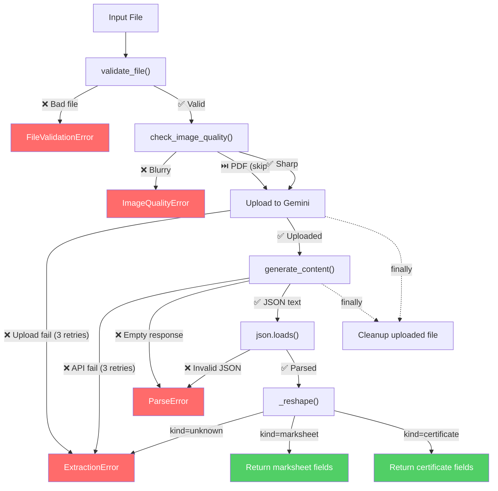
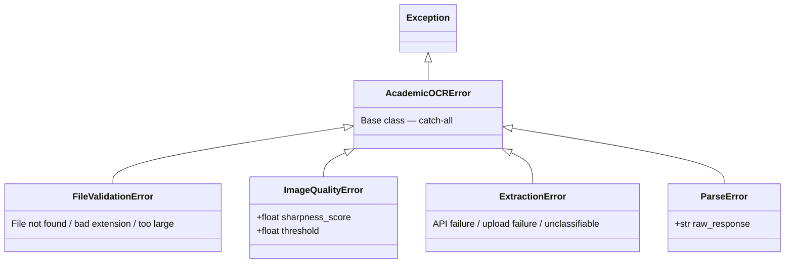

# academic_ocr — Complete Developer Guide

A production-grade Python module for extracting structured data from academic marksheets and certificates using Google Gemini's vision and structured-output capabilities.

---

## Table of Contents

1. [Project Structure](#project-structure)
2. [Setup & Installation](#setup--installation)
3. [API Key Configuration](#api-key-configuration)
4. [Running the Pipeline](#running-the-pipeline)
5. [Integrating Into Your Backend](#integrating-into-your-backend)
6. [Architecture Deep Dive](#architecture-deep-dive)
7. [Exception Handling](#exception-handling)
8. [Output Schemas](#output-schemas)
9. [Configuration & Tuning](#configuration--tuning)
10. [Edge Cases Handled](#edge-cases-handled)

---

## Project Structure

```
academic_ocr/
├── __init__.py          # Package entry — exports AcademicExtractor + all exceptions
├── exceptions.py        # Custom exception hierarchy (5 exception types)
├── extractor.py         # Core extraction engine with retry, cleanup, logging
├── main.py              # CLI demo runner
├── prompt.py            # System prompt for Gemini
├── schemas.py           # TypedDict schemas (SubjectEntry, AcademicRecord, DocumentExtraction)
├── utils.py             # File validation, blur detection, JSON helpers
├── requirements.txt     # Python dependencies
├── .env.example         # API key template
└── sample_outputs/      # Auto-populated with extraction results
```

---

## Setup & Installation

### Prerequisites

- **Python 3.10+** (for `type1 | type2` union syntax in exceptions.py)
- **pip** (comes with Python)

### Step-by-step

```bash
# 1. Navigate to the project root (the directory ABOVE academic_ocr/)
cd "d:\nithin\180DC OCR"

# 2. (Recommended) Create a virtual environment
python -m venv .venv
.venv\Scripts\activate     # Windows
# source .venv/bin/activate  # macOS / Linux

# 3. Install dependencies
pip install -r academic_ocr/requirements.txt
```

> [!NOTE]
> The `requirements.txt` installs:
> - `google-generativeai` — Gemini SDK
> - `typing_extensions` — TypedDict support
> - `python-dotenv` — .env file loading
> - `Pillow` — Image processing for blur detection

---

## API Key Configuration

### Step 1: Get your Gemini API key

Go to **[Google AI Studio](https://aistudio.google.com/app/apikey)** and create a free API key.

### Step 2: Create your `.env` file

```bash
# Copy the template
copy academic_ocr\.env.example .env

# Or create manually — the .env file goes in the project ROOT, not inside academic_ocr/
```

### Step 3: Paste your key

Open `.env` and replace the placeholder:

```env
GEMINI_API_KEY=AIzaSyD_your_actual_key_here

# Optional: set log verbosity (DEBUG for development, INFO for production)
LOG_LEVEL=INFO
```

> [!CAUTION]
> **Never commit your `.env` file to version control.**  
> Add `.env` to your `.gitignore` immediately:
> ```bash
> echo .env >> .gitignore
> ```

### Alternative: Set as environment variable

```bash
# Windows (PowerShell)
$env:GEMINI_API_KEY = "AIzaSyD_your_actual_key_here"

# Windows (CMD)
set GEMINI_API_KEY=AIzaSyD_your_actual_key_here

# macOS / Linux
export GEMINI_API_KEY="AIzaSyD_your_actual_key_here"
```

---

## Running the Pipeline

### CLI Usage

```bash
# From the project root (d:\nithin\180DC OCR)
python -m academic_ocr.main <filepath>
```

### Examples

```bash
# Extract from a JPEG marksheet
python -m academic_ocr.main "D:\documents\marksheet_10th.jpg"

# Extract from a PNG certificate
python -m academic_ocr.main "D:\documents\certificate.png"

# Extract from a multi-page PDF
python -m academic_ocr.main "D:\documents\results.pdf"

# Run with verbose logging
set LOG_LEVEL=DEBUG
python -m academic_ocr.main "D:\documents\marksheet.jpg"
```

### What happens when you run it

```
📄  Processing: marksheet_10th.jpg
───────────────────────────────────────────────────────

2026-04-09 11:20:00 | INFO     | academic_ocr.extractor | Starting extraction: marksheet_10th.jpg
2026-04-09 11:20:00 | INFO     | academic_ocr.utils     | Image quality OK: sharpness=342.50 (threshold=50.00)
2026-04-09 11:20:01 | INFO     | academic_ocr.extractor | File uploaded successfully
2026-04-09 11:20:04 | INFO     | academic_ocr.extractor | Content generated successfully
2026-04-09 11:20:04 | INFO     | academic_ocr.extractor | Extraction complete in 3.82s: kind=marksheet

✅  Extraction successful!

{
  "kind": "marksheet",
  "title": "10th Grade Final Board Exam",
  "exam_type": "final",
  "academicRecord": {
    "gradingMode": "percentage",
    "percentage": 92.5,
    "sgpa": null,
    "cgpa": null,
    "subjects": [
      { "subject": "Mathematics", "score": "95", "maxScore": "100", "grade": null },
      { "subject": "Science", "score": "88", "maxScore": "100", "grade": null }
    ]
  },
  "tags": ["10th Grade", "Final Exam", "CBSE", "2024"]
}

💾  Output saved to: d:\nithin\180DC OCR\academic_ocr\sample_outputs\marksheet_10th_result.json
```

### Exit Codes

| Code | Meaning |
|------|---------|
| `0` | Success — result printed and saved |
| `1` | Configuration error — missing API key or bad arguments |
| `2` | Extraction error — file invalid, blurry image, API failure |

---

## Integrating Into Your Backend

The module is designed to be **imported directly** into any Python backend (Django, FastAPI, Flask, etc.) without modification.

### Basic import

```python
from academic_ocr import AcademicExtractor

extractor = AcademicExtractor(api_key="your-key")
result = extractor.extract("path/to/document.jpg")
print(result)
```

### With full exception handling (recommended)

```python
from academic_ocr import (
    AcademicExtractor,
    FileValidationError,
    ImageQualityError,
    ExtractionError,
    ParseError,
)

extractor = AcademicExtractor(api_key=os.getenv("GEMINI_API_KEY"))

try:
    result = extractor.extract(filepath)

except FileValidationError as e:
    # File not found, wrong format, or too large (>25MB)
    return {"error": "invalid_file", "message": str(e)}

except ImageQualityError as e:
    # Image is too blurry — ask user to re-upload
    return {
        "error": "blurry_image",
        "message": str(e),
        "sharpness_score": e.sharpness_score,
        "min_required": e.threshold,
    }

except ExtractionError as e:
    # Gemini API failed after 3 retries, or document unclassifiable
    return {"error": "extraction_failed", "message": str(e)}

except ParseError as e:
    # Gemini returned invalid JSON (shouldn't happen with schema mode)
    return {"error": "parse_failed", "message": str(e), "raw": e.raw_response}
```

### FastAPI example (when you add the API layer later)

```python
from fastapi import FastAPI, UploadFile, HTTPException
from academic_ocr import AcademicExtractor, ImageQualityError, FileValidationError
import tempfile, os

app = FastAPI()
extractor = AcademicExtractor(api_key=os.getenv("GEMINI_API_KEY"))

@app.post("/extract")
async def extract_document(file: UploadFile):
    # Save uploaded file temporarily
    with tempfile.NamedTemporaryFile(delete=False, suffix=f".{file.filename.split('.')[-1]}") as tmp:
        tmp.write(await file.read())
        tmp_path = tmp.name

    try:
        result = extractor.extract(tmp_path)
        return {"status": "success", "data": result}
    except ImageQualityError as e:
        raise HTTPException(400, detail=f"Image too blurry (score: {e.sharpness_score})")
    except FileValidationError as e:
        raise HTTPException(400, detail=str(e))
    finally:
        os.unlink(tmp_path)
```

---

## Architecture Deep Dive

### Extraction Pipeline Flow



### Key Design Decisions

| Decision | Rationale |
|---|---|
| **Retry with exponential back-off** | Gemini has transient 503s and quota bursts; 3 retries with 2s/4s/8s delays covers 99%+ of cases |
| **Resource cleanup in `finally`** | Uploaded files persist on Google's servers if not deleted; prevents storage leaks at scale |
| **Image downsampling before blur check** | A 4000×3000 photo has 12M pixels; iterating in pure Python is O(n). Downsampling to 1024px max makes it O(1) |
| **Custom exception hierarchy** | Generic `ValueError` is uncatchable by type in a real backend; `ImageQualityError` with `.sharpness_score` gives the API layer actionable data |
| **Structured logging (not `print`)** | Ops teams need log levels, timestamps, and module names; `LOG_LEVEL=DEBUG` for development, `WARNING` in production |
| **`response_schema` enforcement** | Schema mode guarantees valid JSON structure from Gemini; no prompt-only JSON formatting hacks |

### File Responsibilities

| File | Role |
|---|---|
| [schemas.py](file:///d:/nithin/180DC%20OCR/academic_ocr/schemas.py) | TypedDict definitions used by Gemini's structured-output mode |
| [prompt.py](file:///d:/nithin/180DC%20OCR/academic_ocr/prompt.py) | System instruction that tells Gemini how to classify and extract |
| [exceptions.py](file:///d:/nithin/180DC%20OCR/academic_ocr/exceptions.py) | 5-class exception hierarchy for granular error handling |
| [utils.py](file:///d:/nithin/180DC%20OCR/academic_ocr/utils.py) | File validation, Laplacian blur detection, JSON output helpers |
| [extractor.py](file:///d:/nithin/180DC%20OCR/academic_ocr/extractor.py) | Core `AcademicExtractor` class — the only public API surface |
| [main.py](file:///d:/nithin/180DC%20OCR/academic_ocr/main.py) | CLI demo runner for testing and development |

---

## Exception Handling

### Exception Hierarchy



### When each exception is raised

| Exception | Trigger |
|---|---|
| `FileValidationError` | File doesn't exist, unsupported extension, exceeds 25MB, or is 0 bytes |
| `ImageQualityError` | Laplacian variance < 50.0 (image too blurry) |
| `ExtractionError` | Upload fails after 3 retries, Gemini API fails after 3 retries, or `kind="unknown"` |
| `ParseError` | Gemini returns empty text, or `json.loads()` fails on the response |

---

## Output Schemas

### Marksheet Output

```json
{
  "kind": "marksheet",
  "title": "10th Grade Final Board Exam",
  "exam_type": "final",
  "academicRecord": {
    "gradingMode": "percentage",
    "percentage": 92.5,
    "sgpa": null,
    "cgpa": null,
    "subjects": [
      { "subject": "Mathematics", "score": "95", "maxScore": "100", "grade": null },
      { "subject": "Science", "score": "88", "maxScore": "100", "grade": null }
    ]
  },
  "tags": ["10th Grade", "Final Exam", "CBSE", "2024"]
}
```

### Certificate Output

```json
{
  "kind": "certificate",
  "title": "Certificate of Excellence",
  "recipient": "Arjun Sharma",
  "achievement": "1st Place in Regional Science Fair",
  "date": "2024-03-15",
  "tags": ["Science", "District Level", "2024"]
}
```

> [!IMPORTANT]
> - All `score` and `maxScore` values are **always strings**, never numbers
> - `gradingMode` is always one of: `"percentage"`, `"sgpa"`, `"cgpa"`, `"grade"`
> - Missing/illegible fields are `null`, never empty strings or guessed values

---

## Configuration & Tuning

### Environment Variables

| Variable | Default | Description |
|---|---|---|
| `GEMINI_API_KEY` | *(required)* | Your Google AI Gemini API key |
| `LOG_LEVEL` | `INFO` | One of `DEBUG`, `INFO`, `WARNING`, `ERROR` |

### Constants in source (tunable)

| Constant | File | Default | What it controls |
|---|---|---|---|
| `BLUR_THRESHOLD` | `utils.py` | `50.0` | Minimum Laplacian variance to accept an image |
| `MAX_FILE_SIZE_BYTES` | `utils.py` | `25 MB` | Maximum file size allowed for upload |
| `MAX_RETRIES` | `extractor.py` | `3` | Number of API retry attempts |
| `INITIAL_BACKOFF_SECONDS` | `extractor.py` | `2.0` | Starting delay for exponential back-off |
| `_BLUR_CHECK_MAX_DIM` | `utils.py` | `1024` | Max image dimension for blur analysis (performance) |

---

## Edge Cases Handled

| Scenario | How it's handled |
|---|---|
| **Blurry / out-of-focus images** | Laplacian-variance check rejects before API call |
| **Low-light / dark images** | Blur detector still works on edge variance; very dark images may pass but Gemini handles via prompt |
| **Handwritten scores** | Gemini prompt explicitly instructs handling handwritten content |
| **Partially filled documents** | Missing fields returned as `null` — never fabricated |
| **Multi-page PDFs** | Gemini processes all pages; prompt instructs consolidation into single `academicRecord` |
| **Corrupted / truncated images** | `img.load()` forces full decode — Pillow raises early |
| **Empty files (0 bytes)** | Caught by `validate_file()` size check |
| **Oversized files (>25MB)** | Caught by `validate_file()` size check |
| **Unsupported formats (.bmp, .tiff)** | Caught by extension whitelist |
| **Gemini API transient failures** | 3 retries with exponential back-off (2s → 4s → 8s) |
| **Gemini returns empty response** | `ParseError` raised with clear message |
| **Gemini returns malformed JSON** | `ParseError` raised with raw response attached |
| **Unclassifiable document** | `ExtractionError` raised when `kind="unknown"` |
| **Uploaded files lingering on Google servers** | Cleanup in `finally` block — runs on success *and* failure |

---

## Supported File Formats

| Format | Extension(s) | Blur checked? | Notes |
|---|---|---|---|
| JPEG | `.jpg`, `.jpeg` | ✅ | Most common scan format |
| PNG | `.png` | ✅ | Screenshot / digital marksheets |
| WebP | `.webp` | ✅ | Modern compressed format |
| HEIC | `.heic` | ✅ | iPhone photo format |
| PDF | `.pdf` | ⏭️ Skipped | Multi-page supported; blur check requires Ghostscript |
